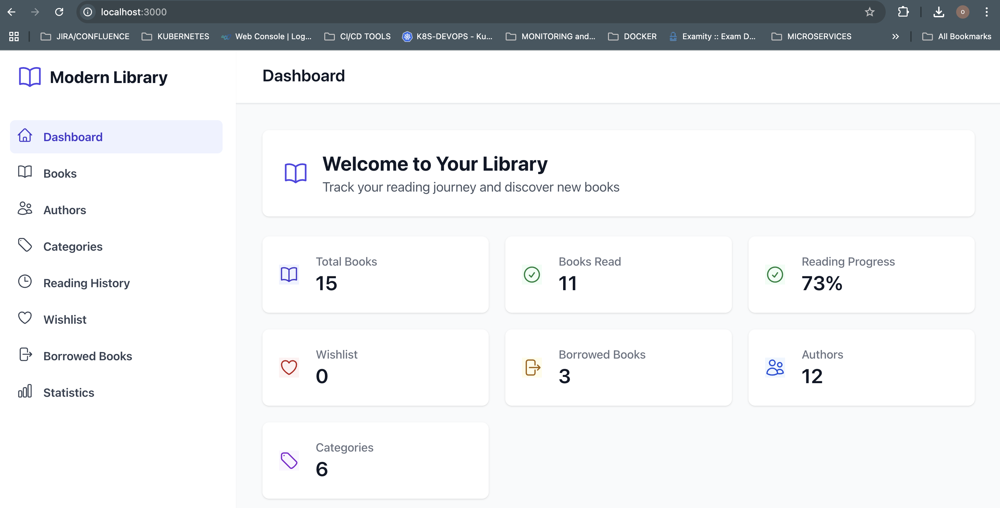
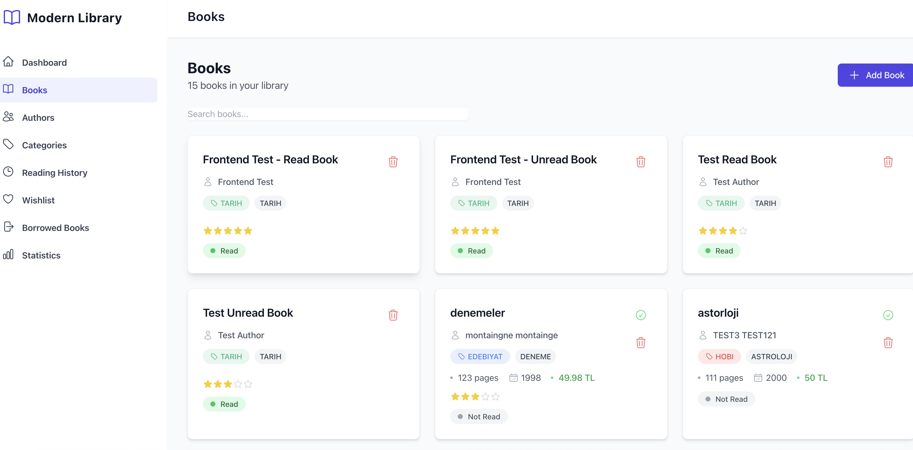
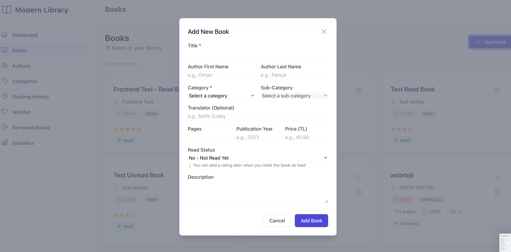
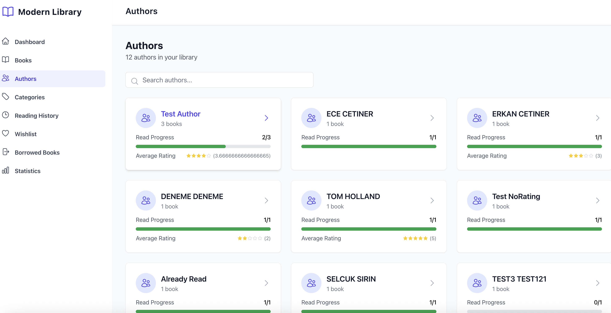
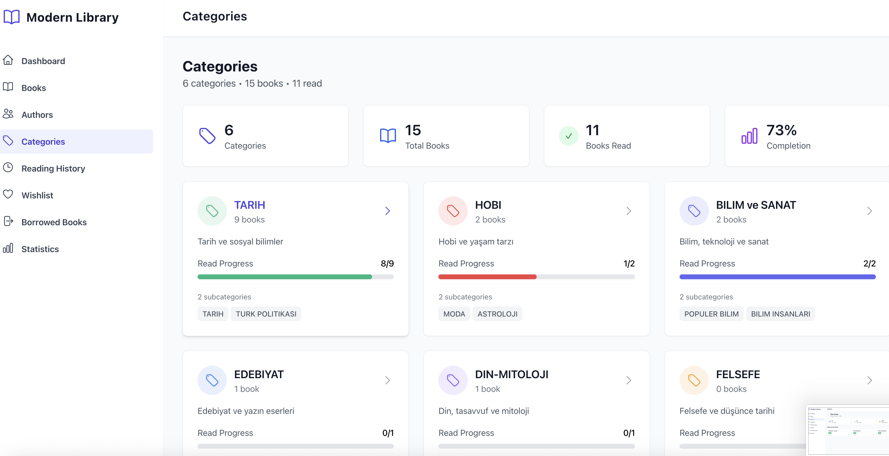
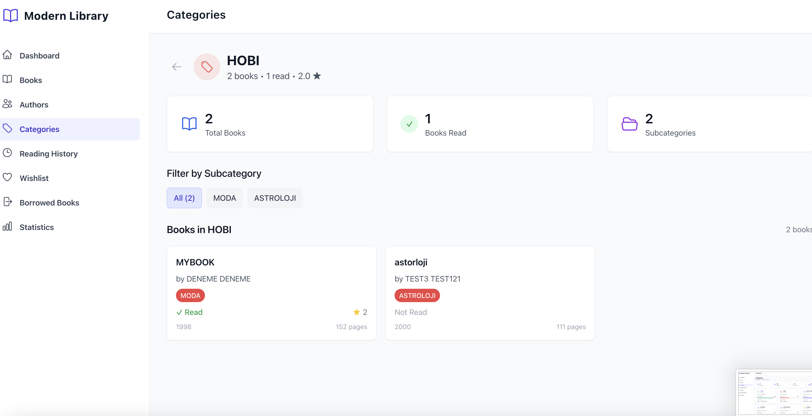
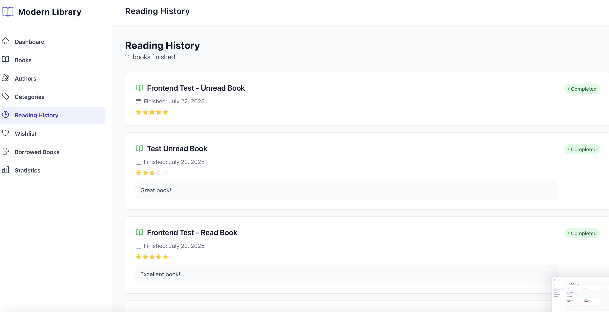
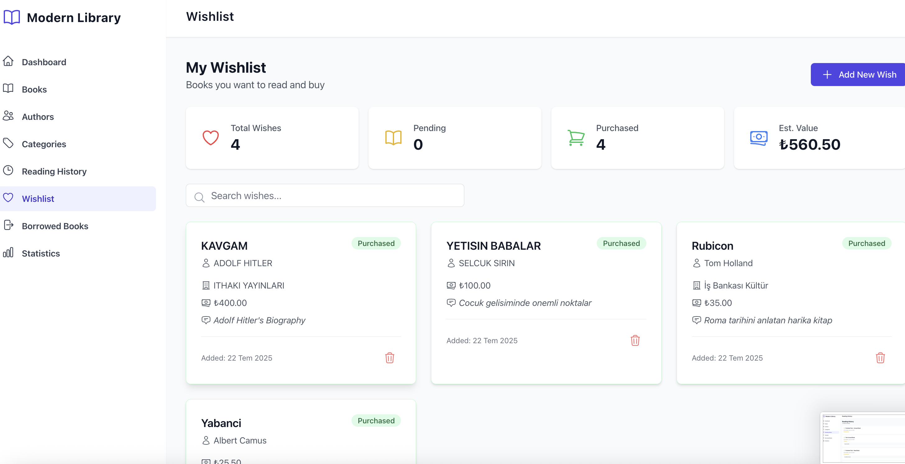
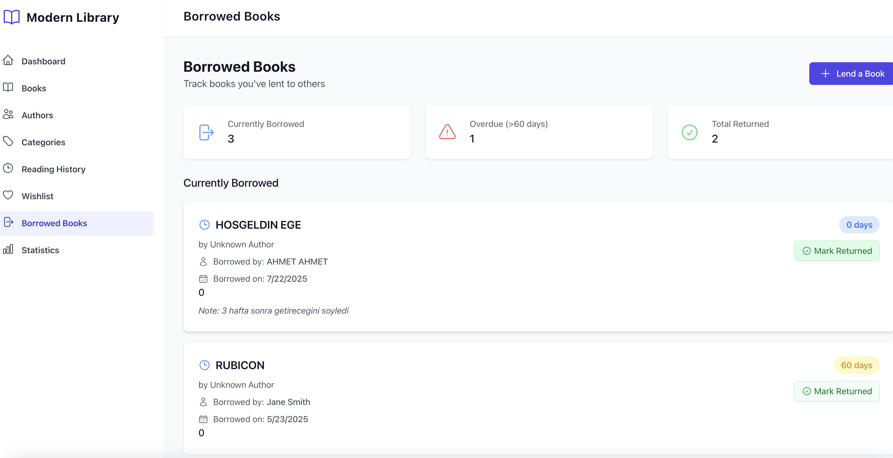
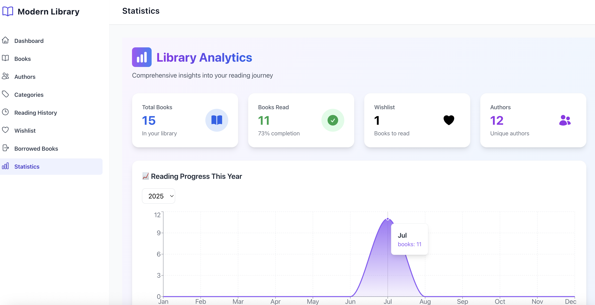

# 📚 Modern Library Management System

> A comprehensive web-based library management system built with modern technologies. Transform your personal library into a powerful, interactive digital experience!



## ✨ Key Features

### 📊 **Smart Dashboard**
- **Real-time Statistics**: Track total books, reading progress, authors, and categories
- **Reading Status Overview**: Visual pie chart of read vs unread books
- **Category Distribution**: See your library organized by genres
- **Recent Reading Activity**: Chronological list of recently finished books
- **Quick Actions**: Fast access to add books, mark as read, view wishlist

### 📚 **Complete Book Management**
- **Add Books**: Rich form with categories, subcategories, ratings, and metadata
- **Smart Search**: Real-time search across titles, authors, and descriptions
- **Status Tracking**: Mark books as read/unread with ratings and completion dates
- **Categories & Subcategories**: Organize books by genre (History, Literature, Science, etc.)
- **Reading Progress**: Track your completion rate with visual indicators

### 👨‍💼 **Author Management**
- **Author Profiles**: View all authors with book counts and average ratings
- **Search Functionality**: Find authors quickly with debounced search
- **Author Details**: See all books by specific authors with reading status

### 🏷️ **Category System**
- **Visual Organization**: Color-coded categories with progress bars
- **Subcategory Support**: Detailed classification (e.g., TARIH → Türk Politikası)
- **Reading Progress**: Track completion rate per category
- **Category Filtering**: Filter books by category and subcategory

### 📖 **Reading History**
- **Complete Timeline**: Chronological history of all finished books
- **Ratings & Notes**: Track your thoughts and ratings for each book
- **Reading Statistics**: See your reading patterns over time

### ❤️ **Smart Wishlist**
- **Book Tracking**: Maintain a wishlist of books you want to read
- **Price Comparison**: Integration with Cimri.com for price checking
- **Purchase Tracking**: Mark items as purchased
- **Publisher & Price Info**: Store additional metadata for wishlist items

### 📤 **Borrowed Books Tracking**
- **Lending Management**: Track books you've lent to others
- **Overdue Alerts**: Visual alerts for books borrowed over 60 days (red flag)
- **Return Tracking**: Mark books as returned with dates
- **Borrower Information**: Store notes and contact details

### 📈 **Advanced Analytics**
- **Reading Progress Charts**: Visual representation of monthly reading habits
- **Category Distribution**: Interactive pie charts showing library composition
- **Top Authors**: Bar charts of most-read authors
- **Achievement Tracking**: Reading streaks, goals, and milestones

## 🖼️ Screenshots

### Dashboard Overview

*Smart dashboard with statistics, recent activity, and quick actions*

### Books Management

*Comprehensive book management with search and filtering*

### Add Book Modal

*Rich form for adding new books with all metadata*

### Authors Section

*Author management with search and book details*

### Categories Overview

*Visual category organization with progress tracking*

### Category Details

*Detailed view of books within specific categories*

### Reading History

*Complete reading timeline with ratings and notes*

### Wishlist Management

*Smart wishlist with price comparison integration*

### Borrowed Books Tracking

*Track lent books with overdue alerts*

### Statistics Dashboard

*Advanced analytics with interactive charts*

## 🛠️ Technology Stack

### Backend
- **Node.js** with Express.js framework
- **SQLite** database for development (PostgreSQL ready)
- **Knex.js** for database migrations and queries
- **Express-validator** for input validation
- **CORS** and security middleware

### Frontend
- **React 18** with modern hooks and functional components
- **React Query** for data fetching and caching
- **React Router** for navigation
- **Tailwind CSS** for modern, responsive styling
- **Heroicons** for consistent iconography
- **Recharts** for interactive data visualization
- **Date-fns** for date formatting

### Features
- **Real-time Search** with debouncing
- **Responsive Design** for all screen sizes
- **Modern UI Components** with animations and transitions
- **Custom Modal System** replacing browser alerts
- **Toast Notifications** for user feedback
- **Advanced Charts** for data visualization

## 🚀 Quick Start

### Prerequisites
- **Node.js 18+** ✅
- **npm 8+** ✅

### Installation

1. **Clone the repository**
   ```bash
   git clone https://github.com/ecetiner87/modern-library.git
   cd modern-library
   ```

2. **Install backend dependencies**
   ```bash
   npm install
   ```

3. **Setup database**
   ```bash
   # Copy environment configuration
   cp env.example .env
   
   # Run database migrations
   npm run migrate
   npm run seed
   ```

4. **Install frontend dependencies**
   ```bash
   cd frontend
   npm install
   cd ..
   ```

5. **Start the application**
   ```bash
   # Terminal 1: Start backend
   npm start
   
   # Terminal 2: Start frontend
   cd frontend && npm start
   ```

6. **Access your library**
   - Frontend: http://localhost:3000
   - Backend API: http://localhost:3001/api

## 📁 Project Structure

```
modern-library/
├── backend/
│   ├── routes/          # API endpoints
│   │   ├── books.js     # Book management
│   │   ├── authors.js   # Author operations
│   │   ├── categories.js # Category system
│   │   ├── reading-history.js # Reading tracking
│   │   ├── wishlist.js  # Wishlist management
│   │   ├── borrowed.js  # Borrowed books
│   │   └── stats.js     # Analytics & statistics
│   ├── database/        # Database layer
│   │   ├── migrations/  # Database schema
│   │   └── seeds/       # Sample data
│   └── server.js        # Main server
├── frontend/
│   └── src/
│       ├── components/  # Reusable components
│       ├── pages/       # Main application pages
│       │   ├── Dashboard.js    # Main dashboard
│       │   ├── Books.js        # Book management
│       │   ├── Authors.js      # Author section
│       │   ├── Categories.js   # Category browser
│       │   ├── ReadingHistory.js # Reading timeline
│       │   ├── Wishlist.js     # Wishlist management
│       │   ├── BorrowedBooks.js # Borrowed tracking
│       │   └── Stats.js        # Analytics dashboard
│       └── services/    # API integration
└── docs/
    └── images/          # Screenshots and documentation
```

## 📊 API Documentation

Complete API documentation is available in [API_DOCUMENTATION.md](API_DOCUMENTATION.md).

### Key Endpoints
- `GET /api/books` - Retrieve books with search and pagination
- `POST /api/books` - Add new books
- `PATCH /api/books/:id/read` - Mark books as read
- `GET /api/authors/from-books` - Get authors with statistics
- `GET /api/categories/distribution` - Category analytics
- `GET /api/reading-history` - Reading timeline
- `GET /api/wishlist` - Wishlist management
- `GET /api/borrowed` - Borrowed books tracking
- `GET /api/stats` - Dashboard statistics

## 🎯 Key Features in Detail

### Smart Book Management
- **Rating System**: 1-5 star ratings with visual display
- **Reading Status**: Clear visual indicators for read/unread books
- **Publication Details**: Track pages, publication year, price, translator
- **Categories**: Multi-level categorization with colors
- **Search**: Real-time search across all book metadata

### Advanced Analytics
- **Reading Progress**: Monthly/yearly reading statistics
- **Category Distribution**: Visual breakdown of your library
- **Author Statistics**: Most-read authors and their ratings
- **Achievement System**: Track reading streaks and milestones

### Modern UI/UX
- **Responsive Design**: Works perfectly on desktop and mobile
- **Dark Mode Ready**: Modern color scheme with customizable themes
- **Interactive Elements**: Hover effects, animations, and transitions
- **Accessibility**: Screen reader friendly with proper ARIA labels
- **Performance**: Optimized loading with React Query caching

### External Integrations
- **Cimri.com Price Comparison**: Direct links to compare book prices
- **Future Ready**: Extensible for Goodreads, Google Books API integration

## 🔧 Configuration

### Environment Variables
```bash
# Database Configuration
DB_CLIENT=sqlite3
DB_FILENAME=./database.sqlite

# Server Configuration
PORT=3001
NODE_ENV=development

# Frontend Configuration (built-in proxy)
REACT_APP_API_URL=http://localhost:3001/api
```

### Database Management
```bash
# Development commands
npm run migrate          # Apply database migrations
npm run seed            # Insert sample data
npm run reset           # Reset database
npm run migrate:rollback # Rollback migrations

# Database exploration
sqlite3 database.sqlite
.tables                  # List all tables
.schema books           # Show table schema
```

## 🚀 Deployment

### Development
Already configured! Just run `npm start` and `cd frontend && npm start`.

### Production (Docker)
```bash
# Build and run with Docker
docker-compose -f docker-compose.yml up -d
```

### Manual Production
```bash
# Backend
npm install --production
npm run migrate
npm start

# Frontend
cd frontend
npm install
npm run build
# Serve build folder with nginx or static server
```

## 📈 Performance & Features

### Optimizations
- **React Query**: Intelligent caching and background updates
- **Debounced Search**: Prevents excessive API calls
- **Lazy Loading**: Components load only when needed
- **SQLite**: Fast local database with excellent performance
- **Responsive Images**: Optimized loading for different screen sizes

### Accessibility
- **Keyboard Navigation**: Full keyboard support
- **Screen Readers**: Proper ARIA labels and roles
- **Color Contrast**: WCAG compliant color schemes
- **Focus Management**: Clear focus indicators

## 🔮 Future Enhancements

### Planned Features
- [ ] **User Authentication**: Multi-user support with personal libraries
- [ ] **Book Cover Upload**: Visual book covers with image management
- [ ] **Reading Goals**: Set and track annual reading goals
- [ ] **Export/Import**: Backup and restore library data
- [ ] **Mobile App**: React Native mobile application
- [ ] **Social Features**: Share reviews and recommendations
- [ ] **Integration**: Goodreads, Google Books API integration
- [ ] **Advanced Analytics**: Reading heat maps and detailed insights

### Technical Improvements
- [ ] **PostgreSQL Migration**: Production-ready database
- [ ] **Full-text Search**: Advanced search with Elasticsearch
- [ ] **Caching Layer**: Redis for improved performance
- [ ] **API Rate Limiting**: Production security measures
- [ ] **Automated Testing**: Comprehensive test suite
- [ ] **CI/CD Pipeline**: Automated deployment

## 🧪 Testing

### Manual Testing
1. **Dashboard**: Verify all statistics display correctly
2. **Books**: Test adding, editing, deleting, and marking as read
3. **Search**: Test search functionality across all sections
4. **Categories**: Verify filtering and subcategory navigation
5. **Wishlist**: Test adding items and Cimri.com integration
6. **Borrowed Books**: Test lending and return tracking

### API Testing
```bash
# Test API endpoints
curl http://localhost:3001/api/health
curl http://localhost:3001/api/books
curl http://localhost:3001/api/stats
```

## 🐛 Troubleshooting

### Common Issues

**Port already in use:**
```bash
lsof -ti:3001 | xargs kill -9
```

**Database locked:**
```bash
rm database.sqlite
npm run migrate
npm run seed
```

**Node modules issues:**
```bash
rm -rf node_modules frontend/node_modules
npm install
cd frontend && npm install
```

## 📞 Support

### Getting Help
1. Check this README for setup instructions
2. Review [API_DOCUMENTATION.md](API_DOCUMENTATION.md) for API details
3. Check the browser console for error messages
4. Verify both frontend and backend servers are running

### Development
```bash
# Check backend status
curl http://localhost:3001/api/health

# Check frontend status
curl http://localhost:3000

# View logs
npm start  # Backend logs
cd frontend && npm start  # Frontend logs
```

## 🤝 Contributing

1. Fork the repository
2. Create a feature branch: `git checkout -b feature/new-feature`
3. Make your changes and test thoroughly
4. Commit your changes: `git commit -m 'Add new feature'`
5. Push to the branch: `git push origin feature/new-feature`
6. Create a Pull Request

## 📄 License

This project is licensed under the MIT License - see the [LICENSE](LICENSE) file for details.

## 🙏 Acknowledgments

- **Modern Web Technologies**: React, Node.js, and the amazing open-source ecosystem
- **UI Libraries**: Tailwind CSS for beautiful, responsive design
- **Chart Libraries**: Recharts for interactive data visualization
- **Community**: All the developers who contributed to the libraries used in this project

---

**Ready to modernize your library management? Get started now!** 🚀

<!--  -->
